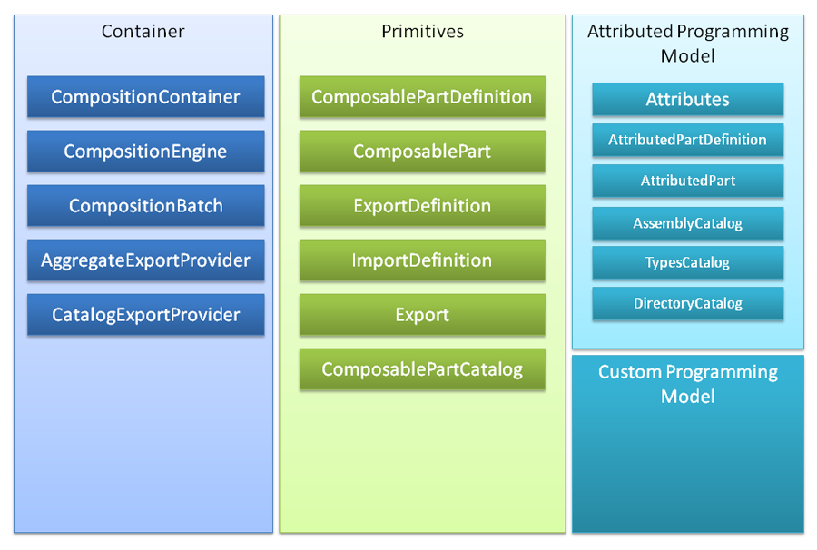
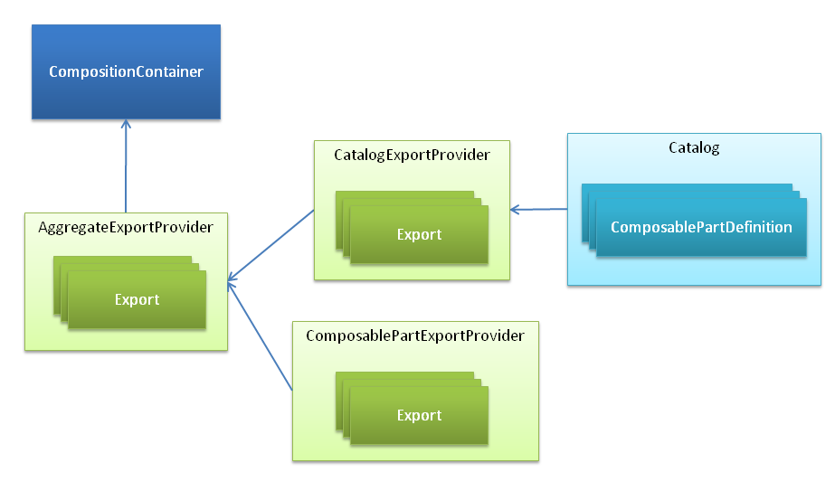

# Architecture Overview 

MEF’s design can be divided into three distinct layers. The container layer, which is most of the public API is available to the user; the primitives, which provides a layer of indirection so MEF won’t be tightly coupled with a single approach to part discovery, imports/exports definitions and so forth; and finally our default implementation of the primitive layer that we call Attributed Programming Model, which relies on types and attributes for discovery and definition of imports/exports. 

The container layer has no dependency on the attributed programming model, instead it solely works with the abstractions provided in the primitives layer. That makes possible to develop a completely different programming model, and have it working together with our default programming model, for example. 

As a product of a major refactoring, the container is currently more of a coordinator and builder of a ExportProvider topology than anything else. The set of ExportProvider instances in use by a container instance is chained, so they can query each other for exports when satisfying dependencies. You can implement a custom ExportProvider to expose exports from any source – for example, WCF, an IoC Container, Remoting.

A whitepaper is available [Hosting the .NET Composition Primitives.pdf](Architecture_Hosting the .NET Composition Primitives.pdf) discussing how the Primitives can be used independently of MEF.
