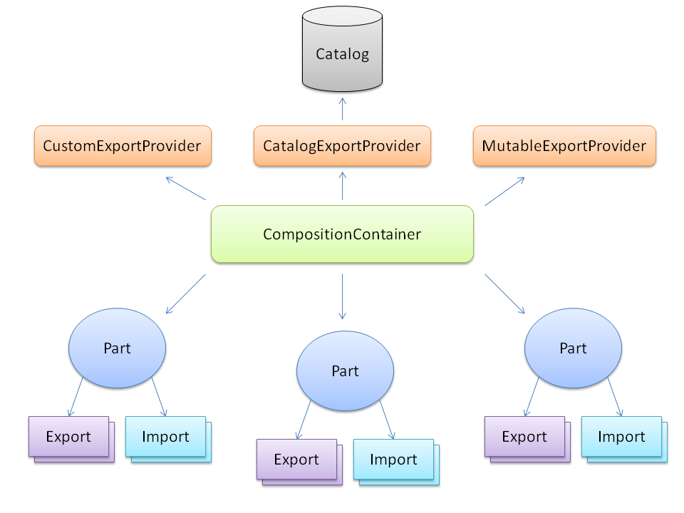

## What is MEF?
The **Managed Extensibility Framework** (or **MEF** for short) simplifies the creation of extensible applications.  MEF offers discovery and composition capabilities that you can leverage to load application extensions.
## What problems does MEF solve?
MEF presents a simple solution for the runtime extensibility problem. Until now, any application that wanted to support a [plugin model](http://en.wikipedia.org/wiki/Plugin) needed to create its own infrastructure from scratch. Those plugins would often be application-specific and could not be reused across multiple implementations.
* MEF provides a standard way for the host application to expose itself and consume external extensions. Extensions, by their nature, can be reused amongst different applications. However, an extension could still be implemented in a way that is application-specific.  Extensions themselves can depend on one another and MEF will make sure they are wired together in the correct order (another thing you won't have to worry about).
* MEF offers a set of discovery approaches for your application to locate and load available extensions. 
* MEF allows tagging extensions with additonal metadata which facilitates rich querying and filtering
## How does MEF work?
Roughly speaking, MEF's core is comprised of a catalog and a **{{CompositionContainer}}**. A catalog is responsible for discovering extensions and the container coordinates creation and satisfies dependencies. 
* MEF's first-class citizen is a **{{ComposablePart}}** (see [Parts](Parts#Parts)). A composable part offers up one or more [Exports](Declaring-Exports), and may also depend on one or more externally provided services or [Imports](Declaring-Imports). A composable part also manages an instance, which can be an object instance of a given type (it is in the default MEF implementation). MEF, however, is extensible and additonal **{{ComposablePart}}** implementations can be provided as long as they adhere to the Import/Export contracts. 
* Exports and imports each have a [Contract](Parts#Contracts). Contracts are the bridge between exports and imports. An export contract can consist of further metadata that can be used to filter on its discovery. For example, it might indicate a specific capability that the export offers.
* MEF's container interacts with [Catalogs](Using-catalogs) to have access to composable parts. The container itself resolves a part's dependencies and exposes Exports to the outside world. You're free to add composable part instances directly to the container if you wish. 
* A **{{ComposablePart}}** returned by a catalog will likely be an extension to your application. It might have Imports (dependencies) on components the host application offers, and it's likely to Export others. 
* The default MEF composable part implementation uses attribute-based metadata to declare exports and imports. This allows MEF to determine which parts, imports, and exports are available completely through discovery.

For more information, see the [MEF Programming Guide](Guide)