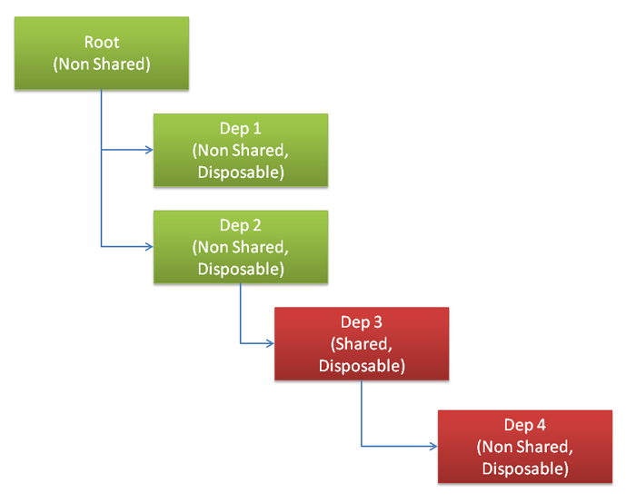
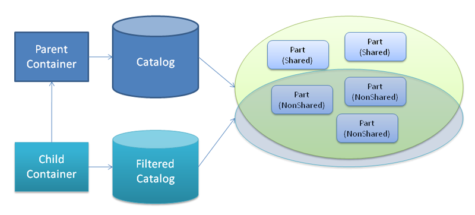

# Parts Lifetime

It’s very important that one understand a parts lifetime within a MEF container and its implications. Given that MEF focuses on open ended applications this becomes especially important as the application authors won’t have control over the set of parts once the app ships and third party extensions come to play. Lifetime can be explained as being the desired “shareability” of a part (transitively, its exports) which translates to the policy that controls when a new part is created as well as when the part will be shut down or disposed.

## Shared, Non Shared and ownership

The “shareability” of a part is defined through the CreationPolicy set (class level) using the PartCreationPolicyAttribute. The following values are supported:
* **Shared**: the part author is telling MEF that at most one instance of the part may exist per container.
* **NonShared**: the part author is telling MEF that each request for exports of the part will be served by a new instance of it.
* **Any or not supplied value**: the part author allows the part to be used as either “Shared” or “NonShared”.

The Creation Policy can be defined on a part using the **{{[System.ComponentModel.Composition.PartCreationPolicyAttribute](System.ComponentModel.Composition.PartCreationPolicyAttribute)}}**:

{code:c#}
[PartCreationPolicy(CreationPolicy.NonShared)](PartCreationPolicy(CreationPolicy.NonShared))
[Export(typeof(IMessageSender))](Export(typeof(IMessageSender)))
public class SmtpSender : IMessageSender
{
}
{code:c#}
{code:vb.net}
<PartCreationPolicy(CreationPolicy.NonShared), Export(GetType(IMessageSender))> 
Public Class SmtpSender
    Implements IMessageSender

End Class
{code:vb.net}

The container will always have the ownership of parts it creates. In other words, the ownership is never transferred to an actor that requested it by using the container instance (directly) or through an import (indirectly). 
Imports can also define or constraint the creation policy of parts used to supply the import values. All you have to do is specify the CreationPolicy enum value for RequiredCreationPolicy:

{code:c#}
[Export](Export)
public class Importer
{
    [Import(RequiredCreationPolicy=CreationPolicy.NonShared)](Import(RequiredCreationPolicy=CreationPolicy.NonShared))
    public Dependency Dep { get; set; }
}
{code:c#}
{code:vb.net}
<Export()>
Public Class Importer
    <Import(RequiredCreationPolicy:=CreationPolicy.NonShared)> 
    Public Property Dep() As Dependency
End Class
{code:vb.net}

This is a useful for scenarios where the “shareability” of a part is relevant for the importer. By default, the RequiredCreationPolicy is set to Any, so Shared and NonShared parts can supply the values.
The following table summarizes the behavior:

|| - || Part.Any || Part.Shared || Part.NonShared ||
| **Import.Any** | Shared | Shared | Non Shared |
| **Import.Shared** | Shared | Shared | _No Match_ |
| **Import.NonShared** | Non Shared | _No Match_ | Non Shared |

Note that when both sides define “Any” the result will be a shared part.

## Disposing the container
A container instance is generally the lifetime holder of parts. Part instances created by the container have their lifetime conditioned to the container’s lifetime. The way to signal the end of the container lifetime is by disposing it. The implications of disposing a container are:

* Parts that implement IDisposable will have the Dispose method called
* Reference to parts held on the container will be cleaned up
* Shared parts will be disposed and cleaned up
* Lazy exports won’t work after the container is disposed
* Operations might throw System.ObjectDisposedException

## Container and parts references

We believe that .Net Garbage Collector is the best thing to rely on for proper clean up. However, we also need to provider a container that has a deterministic behavior. Thus, the container will not hold references to parts it creates unless one of the following is true:

* The part is marked as Shared
* The part implements IDisposable
* One or more imports is configured to allow recomposition

For those cases, a part reference is kept. Combined with the fact that you can have non shared parts and keep requesting those from the container then memory demand can quickly become an issue. In order to mitigate this issue you should rely on one of the following strategies discussed in the next two topics.

## Scoped operations and early reclaim of resources
Some common kinds of applications like web apps and windows services vary greatly from desktop applications. They are more likely to rely on batched and short lived operations. For example, a windows service might watch a directly and once a pre-determined number of file is present, start a batching operation that transforms those files into another format. Web operations may be scoped by per-web-request operations. 

For those scenarios you should either use child containers (explained in the next topic) or release early the object graph. The latter allows the container to dispose and clear out references to non shared parts in the object graph – until it reaches a shared part. 

In order to early release the object graph you need to call the method ReleaseExport exposed by the CompositionContainer:

{code:c#}
var batchProcessorExport = container.GetExport<IBatchProcessor>();

var batchProcessor = batchProcessorExport.Value;
batchProcessor.Process();

container.ReleaseExport(batchProcessorExport);
{code:c#}
{code:vb.net}
Dim batchProcessorExport = container.GetExport(Of IBatchProcessor)() 
Dim batchProcessor = batchProcessorExport.Value
batchProcessor.Process()
container.ReleaseExport(batchProcessorExport) 
{code:vb.net}

The figure below depicts an object graph and show what parts would be released (references removed, disposed) and the ones that would be left untouched:

As the root part is just non shared no reference was being kept by the container, so it is basically a no-operation. We proceed traversing the graph checking the exports served to the root part. Dep 1 is both non shared and disposable, so the part is disposed and its reference is removed from the container. The same happens with Dep 2, however, the export used by Dep is left untouched as it is shared – so other parts may be using it.

Note that the implementation traverses the graph in a depth-first way. 

## Container hierarchies
Another way to approach the same problem is to use container hierarchies. You can create containers and connect them to a parent container, making them child containers. Note that unless you provide a different catalog to the child container, it wouldn’t be of much help as instantiation will continue to happen on the parent. 
Hence, what you should do is either filter the parent catalog based on a criterion that divides the set of parts that should be created on the parent container from those that should be created on the child, or you should specify a completely new catalog that expose a set of parts that should be created on the child container. As the child is expected to be short lived, parts created in it will be released and disposed earlier.  
A common approach is to have Shared parts created on the parent container and Non Shared on the child container. As Shared parts may depend on exports supplied by Non Shared, then the main catalog will have to contain the whole set of parts whereas the child container should have a filtered view of the main catalog with only the non shared parts.

For more information on this topic please check [Filtering Catalogs](Filtering-Catalogs)

## Disposal ordering
Disposal ordering is not guaranteed in any way. That means that you should not try to use an import in your Dispose method. For example:

{code:c#}
[Export](Export)
public class SomeService : IDisposable
{
    [Import](Import)
    public ILogger Logger { get; set; }
    
    public void Dispose()
    {
         Logger.Info("Disposing"); // might throw exception!
    }
}
{code:c#}
{code:vb.net}
<Export()>
Public Class SomeService
    Implements IDisposable
    <Import()>
    Public Property Logger() As ILogger

    Public Sub Dispose()
        Logger.Info("Disposing") ' might throw exception! 
    End Sub
End Class
{code:vb.net}

Using the imported logger instance on your dispose method implementation may be a problem as the implementation of the ILogger contract may also be disposable, and as such may have been disposed already. 

## AddPart/RemovePart

Not every part is created by the container. You can also add and remove parts from it. This process triggers composition and may start creating parts to satisfy dependencies of the part added recursively. When the part added is removed MEF is smart enough to reclaim the resources and dispose the non shared parts used by the part added.
 
**Note:** that MEF will never take ownership of an instance supplied by you, but it does have the ownership of part it creates to satisfy your instance’s imports.

{code:c#}
using System;
using System.ComponentModel.Composition;
using System.ComponentModel.Composition.Hosting;
using System.ComponentModel.Composition.Primitives;

class Program
{
    static void Main(string args)
    {
        var catalog = new AssemblyCatalog(typeof(Program).Assembly);
        var container = new CompositionContainer(catalog);
        var root = new Root();

        // add external part
        container.ComposeParts(root);

        // ... use the composed root instance

        // removes external part
        batch = new CompositionBatch();
        batch.RemovePart(root);
        container.Compose(batch);
    }
}

public class Root
{
    [Import(RequiredCreationPolicy = CreationPolicy.NonShared)](Import(RequiredCreationPolicy-=-CreationPolicy.NonShared))
    public NonSharedDependency Dep { get; set; }
}

[Export, PartCreationPolicy(CreationPolicy.NonShared)](Export,-PartCreationPolicy(CreationPolicy.NonShared))
public class NonSharedDependency : IDisposable
{
    public NonSharedDependency()
    {
    }

    public void Dispose()
    {
        Console.WriteLine("Disposed");
    }
}
{code:c#}
{code:vb.net}
Imports System
Imports System.ComponentModel.Composition
Imports System.ComponentModel.Composition.Hosting
Imports System.ComponentModel.Composition.Primitives

Friend Class Program
    Shared Sub Main(ByVal args() As String) 
        Dim catalog = New AssemblyCatalog(GetType(Program).Assembly) 
        Dim container = New CompositionContainer(catalog) 
        Dim root_Renamed = New Root()

        ' add external part
        container.ComposeParts(root_Renamed) 

        ' ... use the composed root instance

        ' removes external part
        batch = New CompositionBatch()
        batch.RemovePart(root_Renamed) 
        container.Compose(batch) 
    End Sub
End Class

Public Class Root
    <Import(RequiredCreationPolicy:=CreationPolicy.NonShared)> 
    Public Property Dep() As NonSharedDependency
End Class

<Export(), PartCreationPolicy(CreationPolicy.NonShared)> 
Public Class NonSharedDependency
    Implements IDisposable
    Public Sub New()
    End Sub

    Public Sub Dispose() Implements IDisposable.Dispose
        Console.WriteLine("Disposed")
    End Sub
End Class
{code:vb.net}

