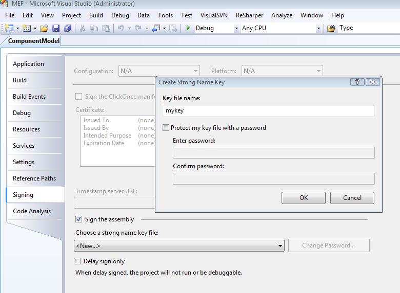

# Signing the Assembly

We have decided not to ship a strong named assembly through our Codeplex release. Our final release to be included in the .net 4.0 will be signed and we believe we should avoid having two signed assemblies out there. 

However, nothing stops you from signing it if you want to use MEF in an existing project that is signed. The following are the steps to required to sign it. 

## Creating a key

* Open the **MEF.sln** solution in Microsoft Visual Studio 2008
* Right click the **ComponentModel** project and select **Properties...**
* Click on the **Signing** tab

* Enter a name for your key and uncheck the "Protect my key file with a password"

The key will be generated and included in your project. 

* On the **ComponentModel** project, open the **AssemblyInfo.cs** file
* Comment the InternalsVisibleTo declarations
* Right click the project and select **Build**

The build should succeed and you'll have a signed assembly. In order to have the whole solution building and run the tests, you need to take a few steps further. 

## Extracting the public key

* Open a Visual Studio Command Prompt
* Type the following command to extract the public keys from the assembly you just built:
{{
C:\dev\MEF_Drop_2009_01_23\bin>sn -Tp System.ComponentModel.Composition.dll

Microsoft (R) .NET Framework Strong Name Utility  Version 3.5.30718.1
Copyright (c) Microsoft Corporation.  All rights reserved.

Public key is
XXXXXXXXXXXXXXXXXXXXXXXXXXXXXXXXXXXXXXXXXXXXXXXXXXXXXX
XXXXXXXXXXXXXXXXXXXXXXXXXXXXXXXXXXXXXXXXXXXXXXXXXXXXXX

Public key token is XXXXXXXXXXXXXXX
}}

Take note of the public key as it will be used on further steps.

## Associate the key you created with the test projects

The test project and test framework needs to be signed too and instead of generating a new key, we will use the key created in the previous step.

* Right click the **ComponentModelUnitTest** project and select **Properties**
* Click on the **Signing** tab
* Make sure the **Sign the assembly** is checked
* Select <Browse...> and pick the key created for the **ComponentModel**

Repeat the same steps for the project **UnitTestFramework**

## Change the InternalsVisibleTo attribute declarations. 

The assembly level attribute InternalsVisibleToAttribute now needs to be changed to include the public key portion of the key you created. 

* On the **ComponentModel** project, open the **AssemblyInfo.cs** file
* Uncomment the InternalsVisibleTo attribute declarations 
* Add the public key that you collected previously to each InternalsVisibleTo declaration. They will look like the following

{code:c#}
[assembly: System.Runtime.CompilerServices.InternalsVisibleTo(
"System.ComponentModel.Composition.UnitTests, PublicKey=XXXXXXXXXXXXXXXXXXXXXXXXXXXXXXXX" + 
"XXXXXXXXXXXXXXXXXXXXXXXXXXXXXXXX" + 
"XXXXXXXXXXXXXXXXXXXXXXXXXXXXXXXX" +
"XXXXXXXXXXXXXXXXXXXXXXXXXXXXXXXX" + 
"XXXXXXXXXXXXXXXXXXXXXXXXXXXXXXXX")]
[assembly: System.Runtime.CompilerServices.InternalsVisibleTo(
"System.ComponentModel.Composition.UnitTestFramework, PublicKey=XXXXXXXXXXXXXXXXXXXXXXXXXXXXXXXX" +
"XXXXXXXXXXXXXXXXXXXXXXXXXXXXXXXX" +
"XXXXXXXXXXXXXXXXXXXXXXXXXXXXXXXX" +
"XXXXXXXXXXXXXXXXXXXXXXXXXXXXXXXX" +
"XXXXXXXXXXXXXXXXXXXXXXXXXXXXXXXX")]
{code:c#}

Where the XXXXX is a really long string.

Repeat the same step for the project **UnitTestFramework**

By now your solution should be compiling without any problems. 